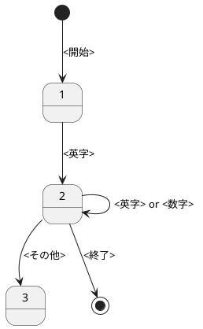

# PlantUML
状態遷移図の作成にはPlantUMLを用いることにした。.puファイルで記述されたプログラムがplantUMLである。

# 利用方法
コードの書き方についてはあとで書く。

puファイルをvscodeで開いて`opt+d`でプレビューが表示できる。（vscodeにPlantUMLのエクステンションは適宜ダウンロードすること）

```plantuml
@startuml read<name>
state 1 {

}

state 2 {

}

state 3 {

}
[*] -down-> 1: <開始>
1 -down-> 2: <英字>
2 -down-> 3: <その他>
2 --> 2: <英字> or <数字>
' 2 --> 2: <数字>
2 --> [*]: <終了>
@enduml
```